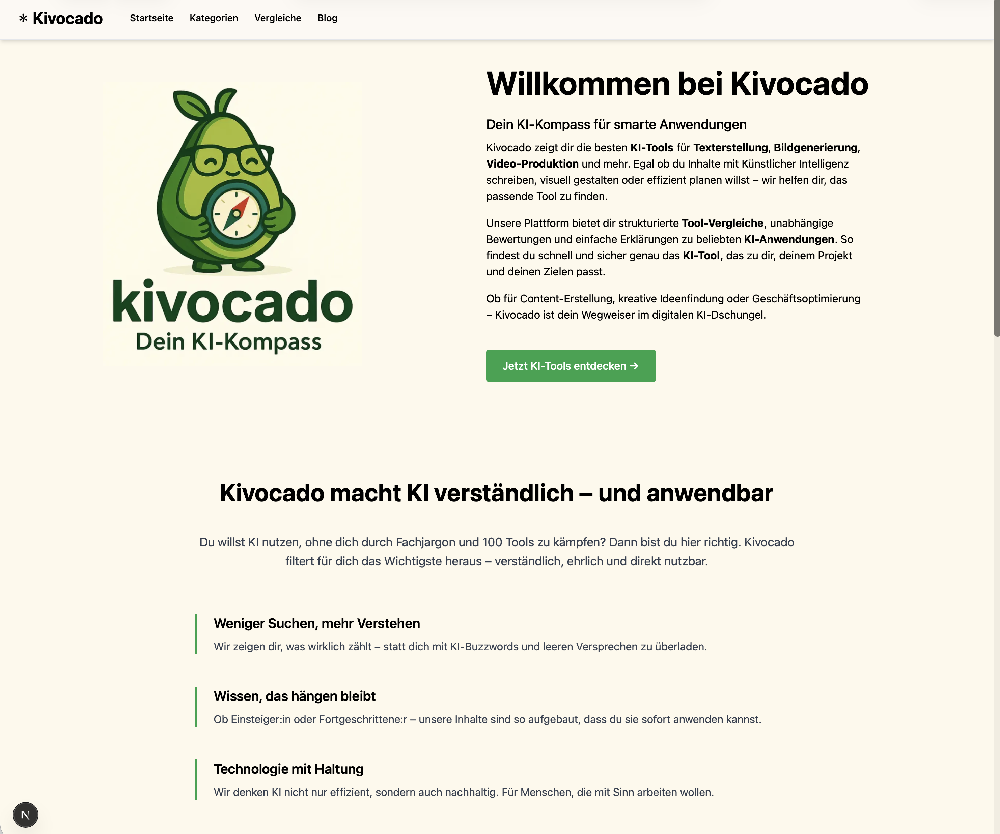
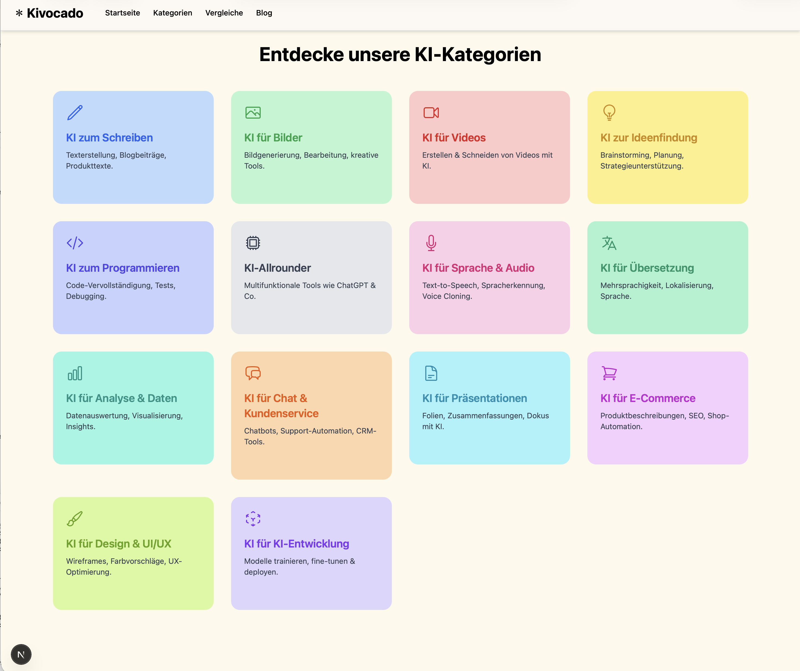

# Kivocado

Kivocado ist eine experimentelle Blog- und Informationsplattform rund um Künstliche Intelligenz.  
Die Website dient als KI-Ratgeber und bietet einen strukturierten Überblick über verschiedene KI-Tools, Anwendungsfälle und Konzepte.

Das Projekt ist bewusst als **offenes, fortlaufendes Lern- und Entwicklungsprojekt** angelegt und erhebt keinen Anspruch auf Vollständigkeit oder einen finalen Zustand.

---

## Screenshots/Preview






---

## Projektidee

Ziel von Kivocado ist es, KI-bezogene Inhalte verständlich, strukturiert und technisch sauber darzustellen.

Der Fokus liegt auf:
- einer klaren, feature-orientierten Seitenstruktur
- modernen Frontend-Best-Practices mit Next.js (App Router)
- komponentenbasierter UI-Architektur
- realistischen Content- und Routing-Szenarien
- SEO-Grundlagen und performanter Seitenstruktur

Das Projekt dient primär der Vertiefung moderner Webtechnologien und als langfristiges Referenzprojekt.

---

## Verwendete Technologien

Das Projekt basiert auf einem aktuellen TypeScript- und React-Ökosystem und entspricht dem Stand der im Repository verwendeten Abhängigkeiten.

Core
- Next.js 15 (App Router)
- React 19
- TypeScript

Styling & UI
- Tailwind CSS
- PostCSS
- Autoprefixer
- Framer Motion (Animationen)
- Heroicons / React Icons

Content & Utilities
- gray-matter (Frontmatter-Parsing)
- remark / remark-html (Markdown-Verarbeitung)
- qs (Query-String-Handling)

Tooling & Qualität
- ESLint (Next.js Config)
- next-sitemap (automatische Sitemap-Generierung)
- npm
- Git & GitHub
Hinweis: MDX wird aktuell nicht produktiv eingesetzt, ist aber technisch vorbereitet und kann später integriert werden.

---

## Projektstruktur und Architektur

Die Anwendung nutzt vollständig den Next.js App Router.
Routen, Layouts und UI-Sektionen sind feature-orientiert organisiert, nicht nach technischen Layern.

```text
src/
├── app/
│   ├── blog/
│   │   ├── [slug]/
│   │   │   └── page.tsx        Dynamische Blog-Detailseiten
│   │   └── page.tsx            Blog-Übersicht
│   │
│   ├── tools/
│   │   ├── [category]/
│   │   │   └── page.tsx        Tool-Kategorien
│   │   └── page.tsx            Tools-Übersicht
│   │
│   ├── datenschutz/
│   │   └── page.tsx
│   │
│   ├── impressum/
│   │   └── page.tsx
│   │
│   ├── start-seite/            UI-Sektionen der Startseite
│   │   ├── HeroSection.tsx
│   │   ├── BlogTeaserSection.tsx
│   │   ├── BlogPreviewSlider.tsx
│   │   ├── ComparisonTeaser.tsx
│   │   ├── KIVerstehenSection.tsx
│   │   ├── KIWissenSection.tsx
│   │   ├── PopularToolsCarousel.tsx
│   │   ├── VertrauenSection.tsx
│   │   └── WarumKivocadoSection.tsx
│   │
│   ├── components/             Seitenübergreifende Komponenten
│   │   └── BlogIntroSection.tsx
│   │
│   ├── header/
│   │   └── Header.tsx
│   │
│   ├── footer/
│   │   ├── Footer.tsx
│   │   └── Icons.tsx
│   │
│   ├── layout.tsx              Globales App-Layout
│   ├── page.tsx                Startseite
│   └── globals.css             Globales Styling
│
├── lib/                         Helper-Funktionen & Datenlogik
│
public/
└── assets/                     Bilder & statische Dateien
```

---

## Entwicklungsstand

Kivocado befindet sich in aktiver Entwicklung:
- Inhalte und Seiten werden schrittweise ergänzt
- Struktur und UI-Sektionen werden regelmäßig refaktoriert
- einzelne Komponenten dienen gezielt Lern- und Experimentierzwecken
- ein abgeschlossener Endzustand ist nicht geplant

---

## Projektziele

- Vertiefung von Next.js App Router-Konzepten
- Saubere React- & TypeScript-Architektur
- Feature-basierte Ordnerstruktur
- Umsetzung realitätsnaher Routing- & Content-Szenarien
- Aufbau eines langfristigen persönlichen Referenzprojekts

---

## Autor

Leonard Zgonjanin
Bachelor of Science Informatik
Angehender Junior Softwareentwickler
